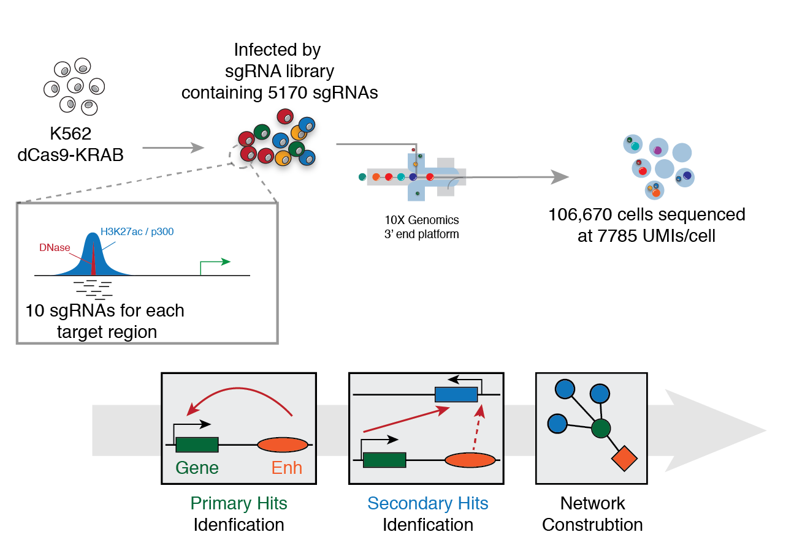

# Global Analysis of 500 enhancer in K562 cells with Mosaic-seq

## Overview
This repository described our scripts and piplines for using Mosaic-seq to functionally evaluate enhancers in K562 cells. Through optimization of key parameters of Mosaic-seq, we demonstrate that both primary and secondary target genes can be identified in the assay. Our investigation of > 500 enhancers in K562 cells reveals an enhancer-centric, interwoven regulatory network that converges to reguate the same sub-modules. 

- Workflow

## Requirement
- Python v3.7
- Numpy
- Scipy
- Pandas
- Matplotlib
- gseapy (for GSEA analysis)

## File Organization

## Notebooks
Plotting Hits -- [Hits_plotting.ipynb](https://nbviewer.jupyter.org/github/russellxie/Global-analysis-K562-enhancers/blob/master/Notebooks/Hits_plotting/Hits_plotting.ipynb)

GSEA Analysis -- [GSEA_analysis.ipynb](https://nbviewer.jupyter.org/github/russellxie/Global-analysis-K562-enhancers/blob/master/Notebooks/GSEA_analysis/GSEA_test.ipynb)

GWAS hits filtering -- [GWAS_data.ipynb](https://nbviewer.jupyter.org/github/russellxie/Global-analysis-K562-enhancers/blob/master/Notebooks/GWAS-analysis/GWAS_data.ipynb)

## Contributors
Russell Xie

## How to cite
