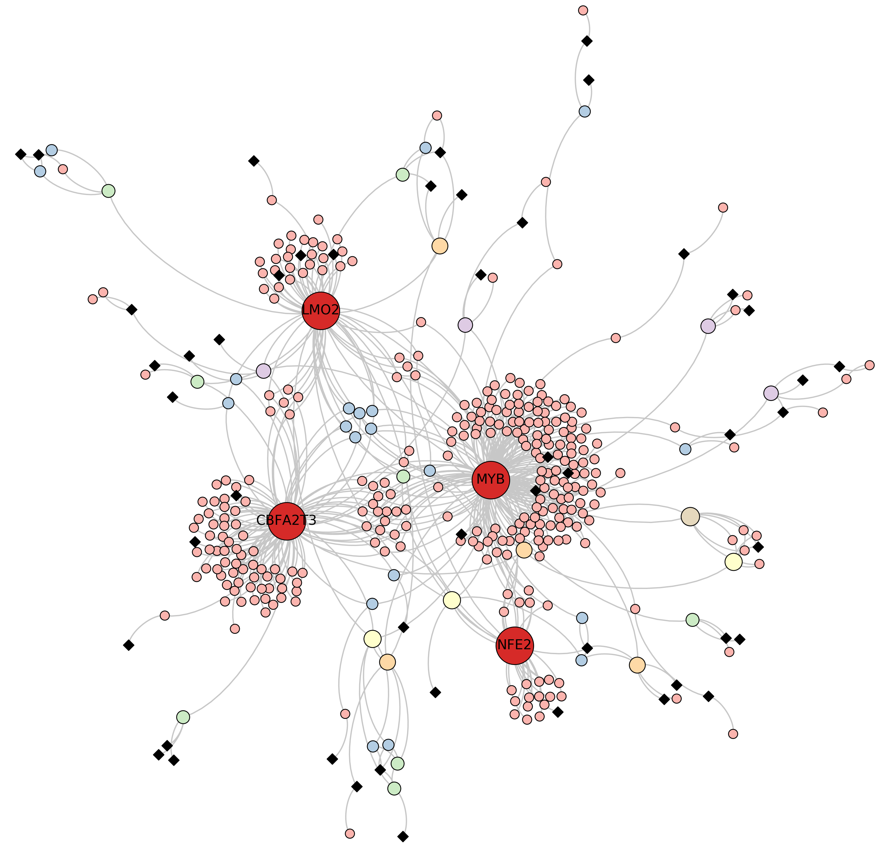

# Global Analysis of 500 enhancer in K562 cells with Mosaic-seq

## Overview
This repository described our scripts and piplines for using Mosaic-seq to functionally evaluate enhancers in K562 cells. Through optimization of key parameters of Mosaic-seq, we demonstrate that both primary and secondary target genes can be identified in the assay. Our investigation of > 500 enhancers in K562 cells reveals an enhancer-centric, interwoven regulatory network that converges to reguate the same sub-modules.

## Requirement
- Numpy
- Scipy
- Pandas
- Matplotlib
- [GSEApy](https://github.com/zqfang/GSEApy)
- [NetworkX](https://github.com/networkx/networkx)
- [Force Atlas 2](https://github.com/bhargavchippada/forceatlas2)
- [Bezier for NetworkX](https://github.com/beyondbeneath/bezier-curved-edges-networkx)

## File Organization

## Original Fastq Files
GEO link:

## Notebooks (In developemnt)
- *Hits Identification*
	- [Plotting Primary and Secondary Hits](https://nbviewer.jupyter.org/github/russellxie/Global-analysis-K562-enhancers/blob/master/Notebooks/Hits_plotting/Hits_plotting.ipynb?flush_cache=true)

- *Network Analysis*
	- [Network Analysis](https://nbviewer.jupyter.org/github/russellxie/Global-analysis-K562-enhancers/blob/master/Notebooks/Network_analysis/Global_hits_calling_and_Network_analysis.ipynb?flush_cache=true)
	

- *Downstream Analysis*
	- [GSEA Analysis](https://nbviewer.jupyter.org/github/russellxie/Global-analysis-K562-enhancers/blob/master/Notebooks/GSEA_analysis/GSEA_test.ipynb?flush_cache=true)
	- [GWAS Hits Filtering](https://nbviewer.jupyter.org/github/russellxie/Global-analysis-K562-enhancers/blob/master/Notebooks/GWAS-analysis/GWAS_data.ipynb?flush_cache=true)

## Contributors
* First Author: Russell Xie `shiqi.xie@utsouthwestern.edu`
* Corresponding Author: Gary Hon `gary.hon@utsouthwestern.edu`

## How to cite
